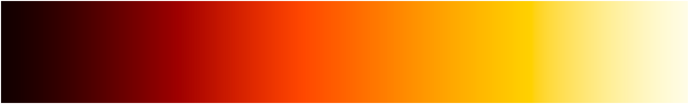
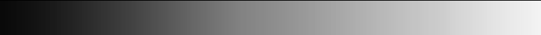
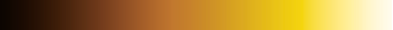
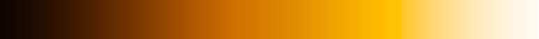
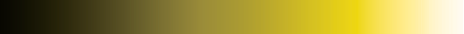
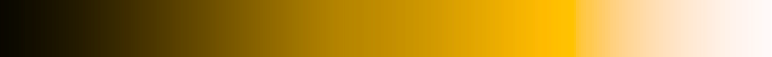
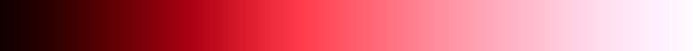
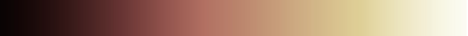

# flame-gradient

This module generates flame gradients like this one:



...going from dark almost-black red to bright almost-white yellow.

## Usage

Get one rgb value for a specific decimal value:

```js
const flameGradient = require('flame-gradient')

const rgb = flameGradient(0.6) // returns 'rgb(255, 150, 1)'
const rgba = flameGradient(0.6, 0.5) // returns 'rgba('255, 150, 1, 0.5)'
```

Generate an entire gradient:

```js
const generate = require('flame-gradient/generate.js')

const arrayOf1000Rgbs = generate(1000)
console.log(arrayOf1000Rgbs)

generate(1000, (rgb) => {
  console.log(rgb) // Logs each of 1000 RGB gradient points
})
```

View a gradient with a set number of points in a new browser window:

```sh
# Defaults to 1000 slices
npm run view

# Set a number of slices
npm run view -- 15
```

## Accessibility

These have been tested to have a good balance of vibrant colour and smooth progression in brightness, such that higher values appear brighter to a consistent amount, including in monohrome and across different types of colour vision deficiency (CVD). This is done by incrementing the R, G and B channels in slightly overlapping sine curves, each slightly stretched based on an approximation of that channel's relative luminosity.

As such they should be usable as colour scales in visualisations.

Examples using [CoBlIs](https://www.color-blindness.com/coblis-color-blindness-simulator/):

Monochrome (Achromatopsia):



Protanomaly ("red-weak"):



Deuteranomaly ("green-weak"):



Tritanomaly ("blue-weak"):


Protanopia ("red-blind"):



Deuteranopia ("green-blind")



Tritanopia ("blue-blind")



Blue cone monochromacy



## Acknowledgements

Sponsored by [nearForm](http://nearform.com)

## License

MIT
